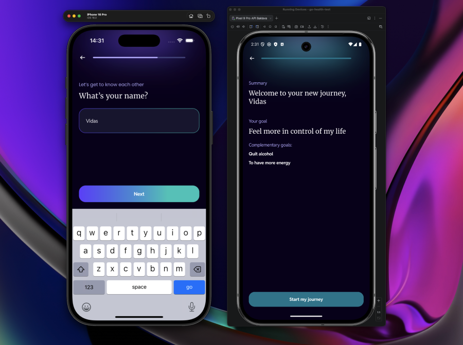
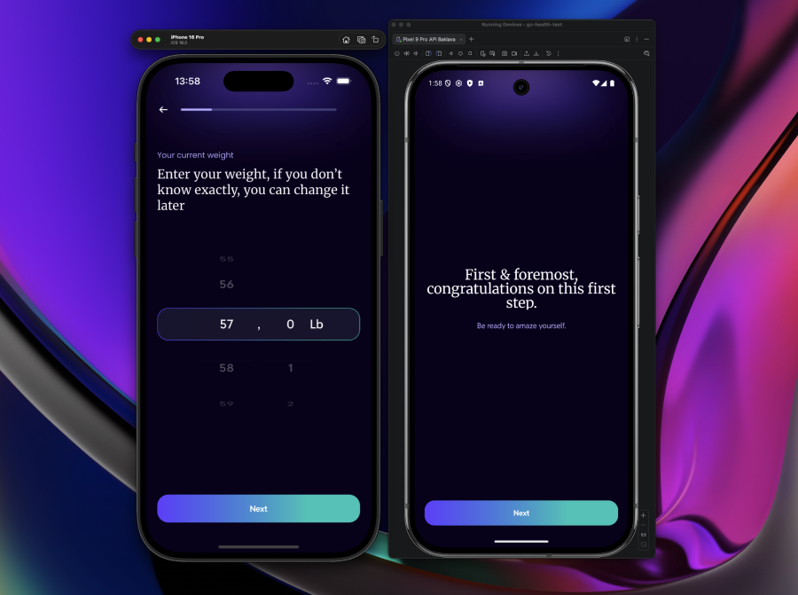

# <span style="color:#0ea5e9">go-health-test</span>

 

An Expo App created as a challenge completion for GO Health - following specific Figma design and Technical Requirements.

## <span style="color:#2563eb">Run</span>

```bash
# 1. Install dependencies
yarn

# 2. Create .env from example
cp .env.example .env

# 3. Start
yarn start
```

Then press `i` for iOS simulator or `a` for Android emulator.

## <span style="color:#7c3aed">Commands</span>

| Command             | Description                 |
| ------------------- | --------------------------- |
| `yarn start`        | Start dev server            |
| `yarn ios`          | Start with iOS simulator    |
| `yarn android`      | Start with Android emulator |
| `yarn lint`         | Run linter                  |
| `yarn format`       | Format code                 |
| `yarn format:check` | Check formatting            |
| `yarn test`         | Run tests                   |

## <span style="color:#059669">Architectural Decisions</span>

### <span style="color:#2563eb">Expo</span>

Expo was chosen as it was a requirement specified in the technical requirements.

### <span style="color:#7c3aed">Color Variables</span>

Color variables are used instead of a theme hook since the app does not need to dynamically switch themes.

### <span style="color:#0d9488">Locale</span>

A locale setup is used instead of hardcoded strings. This keeps text centralized and makes it easy to add more languages later.

### <span style="color:#ea580c">Layout</span>

The app uses a shared layout approach: one background across all screens, a reused header, and identical transitions for both screen navigation and quiz question steps. Screen changes and quiz progression feel like the same flow rather than separate experiences. This keeps the UI consistent and reduces visual noise when moving between areas of the app.

From a rendering perspective, the background and header stay mounted at the layout level instead of being recreated per screen. Only the content area updates on navigation, so React reconciles smaller subtrees and expensive elements (e.g. the glow effects) are not re-mounted. That keeps transitions smooth and avoids layout thrashing.

### <span style="color:#dc2626">Quiz Flow</span>

The quiz is the centerpiece of the app. It is fully driven by config from an API: questions, types, options, and conditional logic (`visibleIf`) all come from the backend. The UI does not hardcode the flow.

A central engine (`useQuizEngine`) computes visible steps from the current answers, validates the current step per question type, and handles forward/back navigation. When a user changes an answer that controls branching (e.g. switching from "quit smoking" to "quit alcohol"), dependent answers in the old branch are cleared so the flow stays consistent. The engine exposes a simple API (`setAnswer`, `goNext`, `goBack`, `currentQuestion`, `isCurrentStepValid`, etc.) that the screen consumes.

Question rendering is polymorphic: `QuestionRenderer` picks the right component (options, weight picker, credentials form, etc.) based on `question.type`. Adding a new question type means adding a component and wiring it in—no engine changes. The quiz runs on a single route with animated transitions between steps (via `key` + Reanimated), so it behaves like a multi-step flow without extra screens or routes.

### <span style="color:#2563eb">Persistence (AsyncStorage)</span>

Quiz state and `hasStartedJourney` are persisted via Zustand's `persist` middleware backed by AsyncStorage. That lets returning users skip the landing screen and open directly on Home; new users see the welcome flow first.

We chose AsyncStorage over MMKV. MMKV is faster (synchronous, memory-mapped, C++ native) and can handle larger or more frequent writes better. However, it needs native modules and extra Expo setup (config plugins or a dev build), which adds friction. AsyncStorage works in Expo Go, requires no native config, and is well-supported. For persisting quiz answers and a few flags on app close, AsyncStorage is sufficient. If we later had heavier storage needs or needed synchronous reads at startup, MMKV would be the better fit.

### <span style="color:#7c3aed">Field Validation</span>

Validation is done with pure functions in `utils/validation.ts` (e.g. `getEmailValidationError`, `getPasswordValidationError`) that return an error message or `null`. The quiz engine calls `isStepValid` per question type—weight range, age range, credentials (via those helpers), single/multiple non-empty—to gate the Next/Submit button. CredentialsQuestion reuses the same functions for inline error display. We avoid schema libraries (zod, yup) here; the rules are simple and the pure functions are easy to test. Errors are shown only after submit attempt or when the user has interacted with the field (`submitAttempted` / `touched`), so we don't flash "invalid" before the user has a chance to finish typing.

### <span style="color:#0d9488">Wheel Picker</span>

Weight and age questions use `@quidone/react-native-wheel-picker` for numeric input. Weight uses two wheels (kg + lb) synced via `wheelValues` utils. A render gate (`useWheelPickerRenderGate`) defers mounting the picker until the app is ready and `InteractionManager` is idle; until then we show a `SpinningBuffer`. That avoids layout jank when the quiz screen mounts. The gate state is stored in `wheelPickerStore`, and the bottom CTA stays disabled while the buffer is showing so the user can't proceed before the picker is interactive.

### <span style="color:#ea580c">Skia</span>

We use `@shopify/react-native-skia` for GPU-accelerated 2D graphics. The glowing background is built from `GlowObject` components: blurred `RoundedRect`s with `interpolateColors` and Reanimated worklets for drift and scale. Skia runs on the native thread and integrates with Reanimated, so those animations stay smooth. Buttons, option cards, and gradients (`AppButton`, `AppOptionSelectOuter`, `GradientLayer`) also use Skia for `RoundedRect`s and `LinearGradient`s. Pure React Native blur and gradient APIs are limited; Skia gives programmatic control and smooth animations without pre-rendered assets.

### <span style="color:#059669">TanStack Query</span>

Quiz questions are loaded from the API via `useQuizQuestions`, which wraps `useQuery` from `@tanstack/react-query`. TanStack handles loading, error, and caching with minimal code; we expose `questions`, `isLoading`, `isError`, and `refetch` from the hook. The query is `enabled` only when the API URL is configured, so we avoid failed requests in development and surface a clear config error instead. Stale-while-revalidate keeps returning users from refetching on every mount. We could fetch with `useState`/`useEffect`, but that would mean manual loading/error handling, no cache, and duplicated requests if multiple components needed the data. TanStack gives a single source of truth for server state with built-in deduplication.

### <span style="color:#dc2626">Reanimated</span>

We use `react-native-reanimated` for all animations. It runs on the UI thread via worklets instead of the JS bridge, so animations stay at 60fps even when JS is busy. Screen and quiz-step transitions use layout animations (`FadeInRight`, `FadeOutLeft` with entering/exiting). Shared values drive press feedback, progress bars, focus overlays, and the glow drift; `useDerivedValue` and `useAnimatedStyle` keep Skia in sync (e.g. `GlowObject` color and transform). The glow store animates `glowProgress` with `withTiming` and uses `runOnJS` for completion callbacks. React Native's built-in `Animated` API runs on the JS thread and can stutter under load; Reanimated avoids that and integrates well with Skia's worklet-based APIs.

### <span style="color:#2563eb">Errors (Toasts)</span>

Async and global failures—API fetch errors, font load failures—are surfaced via `@backpackapp-io/react-native-toast`. We use `showErrorToast(message)` from `utils/toast.tsx`, which triggers `toast.error()` with a custom styled error chip (red background, icon, constrained width). The `Toasts` component lives in `AppProviders` and renders above the app. The imperative API lets any part of the app report errors without prop drilling. Toasts are non-blocking and auto-dismiss; they suit one-off failures where the user may retry or navigate away. Form validation errors stay inline (`AnimatedError` on fields) since they're tied to specific inputs. For this app's scope, a single `showErrorToast` abstraction is enough; we don't need a central error boundary or modal for these cases.

### <span style="color:#7c3aed">Keyboard Avoidance</span>

When the keyboard opens (e.g. on the credentials question), we lift the bottom CTA so it stays visible above the keys instead of using `KeyboardAvoidingView`. `ScreenWithBottomAction` listens to `keyboardWillShow` / `keyboardWillHide` on iOS and `keyboardDidShow` / `keyboardDidHide` on Android, then animates a `translateY` on the footer based on keyboard height. `QuizFlowScreenShell` enables this via `actionKeyboardAvoiding`. We use the native driver for the lift animation. `KeyboardAvoidingView` can conflict with custom layouts and behave differently across devices; a simple footer lift keeps the CTA in view without touching the rest of the layout. CredentialsQuestion also uses `keyboardShouldPersistTaps="handled"` and `keyboardDismissMode="interactive"` so taps register and the keyboard can be dragged closed.
